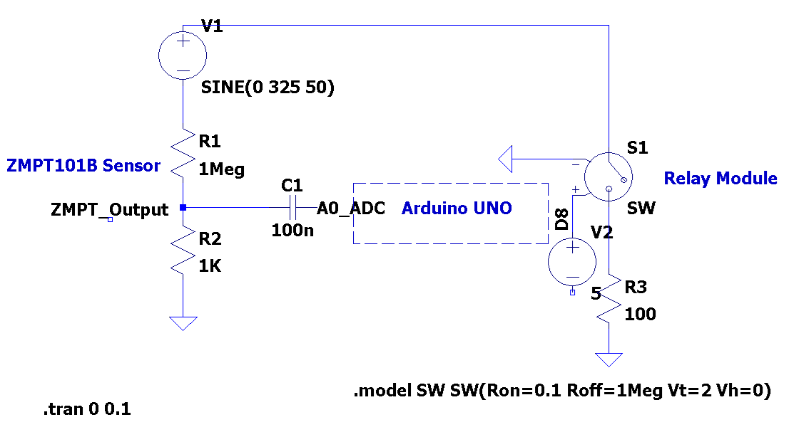

# Embedded Voltage Protection and Monitoring System

## Overview
This project implements an embedded over-voltage and under-voltage protection system for
230V AC mains. The system continuously monitors the mains voltage and disconnects the load
when unsafe voltage conditions are detected.

## Hardware Description
- ZMPT101B AC voltage sensor for mains voltage sensing
- Arduino microcontroller for signal processing and control
- Relay module for load switching
- 16×2 I2C LCD for real-time display
- AC load (bulb)

## System Working
The 230V AC mains voltage is sensed using the ZMPT101B voltage sensor. The sensor output is
connected to the Arduino analog input pin.

The Arduino’s internal ADC converts the analog sensor voltage into digital values. These
samples are processed in software to calculate the RMS value of the mains voltage.

Based on the calculated RMS voltage:
- The real-time voltage and system status (Normal / Under Voltage / Over Voltage) are
  displayed on the LCD.
- A relay is controlled to connect or disconnect the load.

## Protection Logic
The system uses software hysteresis to avoid relay chattering.

- Under-voltage trip ON: 185 V  
- Under-voltage trip OFF: 190 V  
- Over-voltage trip ON: 235 V  
- Over-voltage trip OFF: 230 V  

These threshold values are defined in the source code and can be adjusted as required.

## Software Highlights
- ADC-based voltage sensing
- RMS voltage calculation
- Finite-state based protection logic
- Relay switching with minimum delay protection
- Real-time LCD status display

## Applications
- Protection of household and laboratory electrical loads
- Educational demonstration of embedded voltage monitoring
- Basic power protection systems

## Future Improvements
- Improve ADC accuracy through calibration and filtering
- Implement fault logging
- Port the design to a 32-bit microcontroller (STM32/ESP32)

- ## Circuit Diagram

The following schematic shows the voltage sensing, Arduino interfacing,
and relay-based load protection used in this project.

